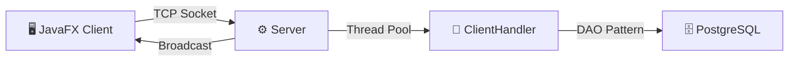

# 🚀 Java Real-Time Messaging System

[](https://www.oracle.com/java/technologies/javase/jdk17-archive-downloads.html)
[](https://openjfx.io/)
[](https://hibernate.org/)
[](https://www.postgresql.org/)
[](https://maven.apache.org/)
[](LICENSE)

> A robust, multi-threaded real-time messaging application built with **Java 17**, **JavaFX**, and **Hibernate**. This project demonstrates advanced software engineering principles including multi-threading, socket programming, and persistence management.

---

## 🏛️ Architecture & Design Patterns

The application follows a standard **Client-Server** architecture with specialized layers for business logic and data access.



| Pattern | Implementation | Purpose |
|:---|:---|:---|
| **Thread-per-client** | `ClientHandler` | Non-blocking client communication |
| **Singleton** | `HibernateUtil`, `ServerConnection` | Shared resource management |
| **DAO** | `UserDAO`, `MessageDAO` | Decoupled data access layer |
| **MVC** | FXML + Controllers | Clean UI separation |
| **Custom Protocol** | Pipe-delimited (`\|`) | Lightweight network exchange |

---

## ✨ Key Features

- [x] **Authentication** — Secure registration and login with **SHA-256** password hashing
- [x] **Real-time Chat** — Instant message exchange using TCP Sockets
- [x] **Message Status** — WhatsApp-style delivery tracking (Sent ✓ · Received ✓✓ · Read ✓✓ blue)
- [x] **Persistence** — Full message history stored in **PostgreSQL** via Hibernate ORM
- [x] **File Transfer** — Send images and documents via **Base64** encoding
- [x] **Online Presence** — Real-time status indicators (Online / Offline)
- [x] **Typing Indicators** — Visual feedback when a contact is typing
- [x] **Unread Counts** — Visual badges for missed messages
- [x] **Splash Screen** — Animated launch screen

---

## 🛠️ Tech Stack

| Component | Technology | Version |
|:---|:---|:---|
| **Language** | Java (LTS) | 17 |
| **GUI Framework** | JavaFX | 17.0.2 |
| **ORM** | Hibernate | 6.4.0 |
| **Database** | PostgreSQL | 16 |
| **Build Tool** | Maven | 3.8+ |
| **Security** | SHA-256 Hashing | — |

---

## 🚀 Getting Started

### Prerequisites

- Java 17+ ([Download](https://adoptium.net/))
- Maven 3.8+ ([Download](https://maven.apache.org/download.cgi))
- PostgreSQL 16 ([Download](https://www.postgresql.org/download/))

### 1. Clone the repository

```bash
git clone https://github.com/YOUR_USERNAME/messaging-app.git
cd messaging-app
```

### 2. Configure the environment

```bash
cp .env.example .env
# Edit .env with your PostgreSQL credentials
```

Then update `resources/hibernate.cfg.xml` with your database credentials:

```xml
<property name="hibernate.connection.username">YOUR_USERNAME</property>
<property name="hibernate.connection.password">YOUR_PASSWORD</property>
```

> [!NOTE]
> Tables are automatically generated by Hibernate on first launch (`hbm2ddl.auto=update`).

### 3. Launch the Server

```bash
mvn compile
mvn exec:java -Dexec.mainClass="server.Server"
```

### 4. Launch the Client

```bash
mvn javafx:run
```

> [!TIP]
> You can run multiple clients simultaneously to test the messaging functionality.

---

## 📡 Communication Protocol

The application uses a lightweight, pipe-delimited text-based protocol:

| Command | Format | Description |
|:---|:---|:---|
| **Register** | `REGISTER\|user\|pass` | Create a new account |
| **Login** | `LOGIN\|user\|pass` | Authenticate and go online |
| **Send** | `SEND\|receiver\|msg` | Send a private text message |
| **File** | `SEND_FILE\|rec\|name\|data` | Send a Base64-encoded file |
| **Typing** | `TYPING\|receiver` | Signal typing activity |
| **Mark Read** | `MARK_READ\|sender` | Set messages as read |

---

## 📂 Project Structure

```
messaging-app/
├── .github/
│   ├── ISSUE_TEMPLATE/         # Bug report & feature request templates
│   ├── workflows/build.yml     # CI/CD pipeline
│   └── PULL_REQUEST_TEMPLATE   # PR checklist
├── src/main/java/
│   ├── server/                 # Server core & ClientHandler threads
│   ├── client/                 # JavaFX App, Controllers & ServerConnection
│   ├── model/                  # JPA Entities (User, Message, Status)
│   ├── dao/                    # Data Access Objects
│   └── util/                   # HibernateUtil & PasswordUtil
├── resources/
│   ├── *.fxml                  # JavaFX views (login, register, chat, splash)
│   ├── style.css               # Application stylesheet
│   └── hibernate.cfg.xml       # Hibernate configuration
├── .env.example                # Environment variables template
├── .gitignore                  # Git exclusions
├── CHANGELOG.md                # Version history
├── CONTRIBUTING.md             # Contribution guide
├── LICENSE                     # MIT License
├── SECURITY.md                 # Security policy
├── pom.xml                     # Maven build configuration
└── README.md                   # This file
```

---

## 🤝 Contributing

Contributions are welcome! Please read our [Contributing Guide](CONTRIBUTING.md) before submitting a PR.

---

## 🔒 Security

See [SECURITY.md](SECURITY.md) for our security policy and how to report vulnerabilities.

---

## 📄 License

This project is licensed under the **MIT License** — see the [LICENSE](LICENSE) file for details.

---

<p align="center">
  <sub>Built with ❤️ as part of the <strong>L3GL — ISI</strong> curriculum</sub>
</p>
